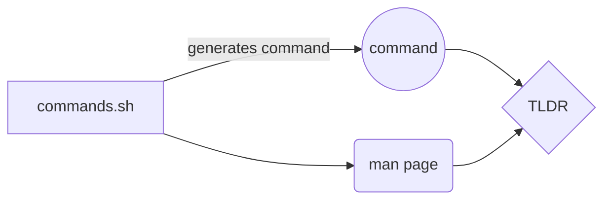

# Learn Linux Commands!

**Generates Basic Linux Commands like**;
ls
 pwd 
 cd
 mkdir 
 rmdir 
 rm
 cp
 mv
 and many more! 

# Perquisites 

**Install [TLDR](https://github.com/tldr-pages/tldr)
 
## How it works

